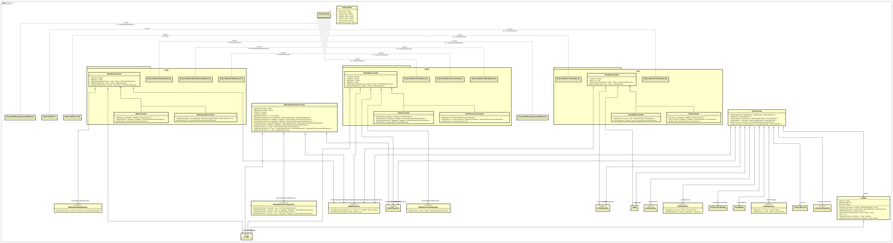
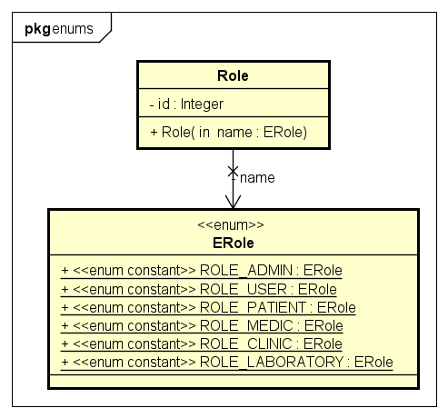
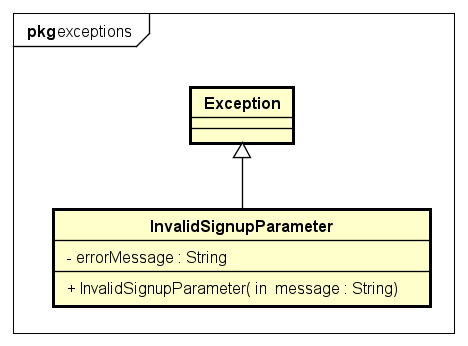
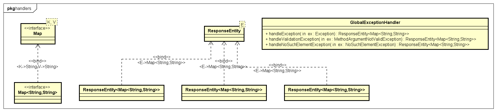
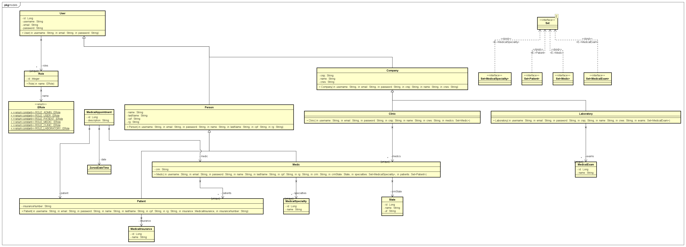
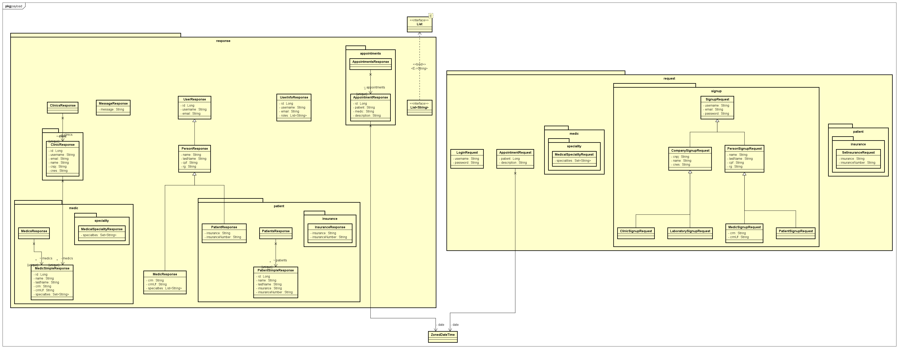
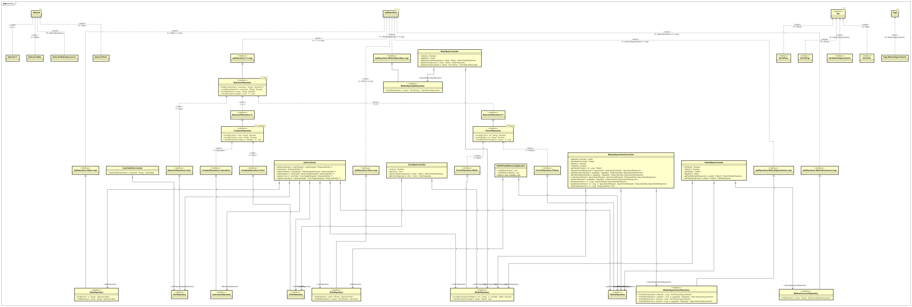
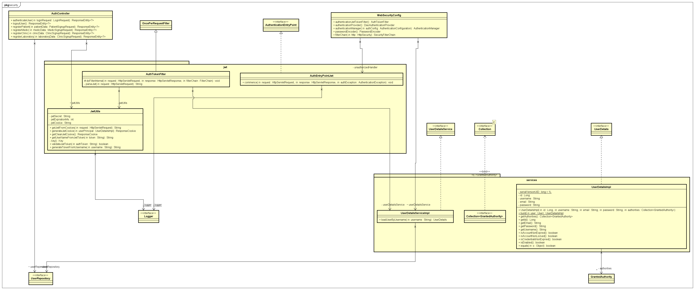
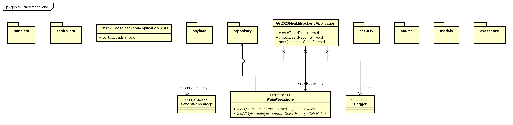

# FIAP GLOBAL SOLUTION - 2023 2TDSPT

## Desafio

### “Inovação e Tecnologia Moldando o Futuro da Saúde: Prevenção, Automação e Precisão"

## Integrantes

- [Kaik Wulck Bassanelli](https://github.com/kaikwb) RM: 96731  
Ficou responsável pelos entregáveis:
  - DATABASE APPLICATION & DATA SCIENCE
  - DIGITAL BUSINESS ENABLEMENT
  - ENTERPRISE APPLICATION DEVELOPMENT

- [Leonardo de Barros Silva](https://github.com/negreiroleo) RM: 97582  
  Ficou responsável pelos entregáveis:
  - HYBRID MOBILE APP DEVELOPMENT
- [Lucas Satoru Shiaku](https://github.com/LucasShiaku) RM: 97019  
  Ficou responsável pelos entregáveis:
  - DISRUPTIVE ARCHITECTURES: IT, IOB & IA
- [Pablo Lage Carral](https://github.com/Pablo-Lage-Carral) RM 97282  
  Ficou responsável pelos entregáveis:
  - DEVOPS TOOLS & CLOUD COMPUTING
- [Rafael Vieira Pinto](https://github.com/Rafa2318) RM: 97117  
  Ficou responsável pelos entregáveis:
  - COMPLIANCE & QUALITY ASSURANCE

## O Problema

Um dos problemas que a área da saúde enfrenta é a falta de um sistema de prontuário eletrônico que seja acessível a 
todos os profissionais da saúde, que seja seguro e que possa ser acessado de qualquer lugar, permitindo que o paciente 
tenha acesso a ele e possa compartilhar com outros profissionais da saúde que o atendam.

O desafio da falta de um sistema de prontuário eletrônico abrangente na área da saúde é uma questão crucial que afeta a 
eficiência e a qualidade dos cuidados prestados. A ausência de uma solução acessível a todos os profissionais de saúde 
cria barreiras na comunicação e compartilhamento de informações vitais do paciente. Um sistema ideal deve ser seguro, 
garantindo a confidencialidade das informações médicas, e ao mesmo tempo ser acessível de forma remota, possibilitando a
consulta e atualização do prontuário de qualquer local.

A implementação de um prontuário eletrônico unificado resolveria não apenas a fragmentação da informação, mas também 
promoveria uma abordagem mais holística no tratamento do paciente. Além disso, permitir que os pacientes acessem seus 
próprios registros e compartilhem facilmente com outros profissionais de saúde facilitaria a continuidade do 
atendimento, especialmente em situações onde diferentes especialistas estão envolvidos no cuidado do paciente.

A segurança da informação é uma consideração crítica nesse contexto, uma vez que dados médicos são sensíveis e precisam 
ser protegidos contra acessos não autorizados. A implementação de medidas robustas de segurança, como criptografia e 
autenticação forte, seria essencial para garantir a integridade e confidencialidade dos registros médicos.

Portanto, a busca por um sistema de prontuário eletrônico abrangente, seguro e acessível é fundamental para superar os 
desafios atuais na área da saúde, promovendo uma melhor coordenação entre os profissionais e proporcionando um cuidado 
mais eficiente e centrado no paciente.

## A Solução

A solução proposta é um sistema de prontuário eletrônico que seja acessível a todos os profissionais da saúde, que seja 
`seguro` e que possa ser acessado de qualquer lugar, permitindo que o paciente tenha acesso a ele e possa compartilhar 
com outros profissionais da saúde que o atendam.

O sistema de prontuário eletrônico proposto é um sistema web que pode ser acessado de qualquer lugar, desde que o
profissional de saúde tenha acesso à internet. O sistema é acessível através de um navegador web, não sendo necessário
instalar nenhum software adicional. O sistema é acessível através de um login e senha, garantindo a segurança das
informações médicas. O sistema permite que o profissional de saúde acesse o prontuário do paciente, visualize o
histórico de consultas, exames e procedimentos, e também permite que o profissional de saúde atualize o prontuário do
paciente, inserindo novas informações. O sistema também permite que o paciente acesse seu próprio prontuário, e
compartilhe com outros profissionais de saúde que o atendam.

## Escopo de Desenvolvimento

O escopo de desenvolvimento do sistema de prontuário eletrônico proposto é o seguinte:
- O sistema deve ser acessível por um navegador web, não sendo necessário instalar nenhum software adicional.
- O sistema deve ser acessível por um login e senha, garantindo a segurança das informações médicas.
- O sistema deve permitir que o profissional de saúde acesse o prontuário do paciente, visualize o histórico de
  consultas, exames e procedimentos.
- O sistema deve permitir que o profissional de saúde atualize o prontuário do paciente, inserindo novas informações.
- O sistema deve permitir que o paciente acesse seu próprio prontuário.
- O sistema deve permitir que o paciente compartilhe seu prontuário com outros profissionais de saúde que o atendam.

## O que ficou faltando

Por limitações de tempo, não foi possível implementar os seguintes requisitos:

- O sistema não tem a funcionalidade de agenda de consultas e nem o calendário de consultas.
- O sistema não tem as funcionalidades de exames e procedimentos.

## Tecnologias utilizadas

- [Spring 3.20](https://spring.io/)
- [Spring Boot 3.20](https://spring.io/projects/spring-boot)
- [Spring Data JPA 3.20](https://spring.io/projects/spring-data-jpa)
- [Spring Security 3.20](https://spring.io/projects/spring-security)
- [Spring Web 3.20](https://spring.io/projects/spring-web)
- [Spring Validation 3.20](https://spring.io/projects/spring-validation)
- [JJWT 0.11.5](https://github.com/jwtk/jjwt)
- [Lombok 1.18.20](https://projectlombok.org/)
- [Oracle Database 19c](https://www.oracle.com/br/database/technologies/appdev/xe.html)
- [IntelliJ IDEA 2023.2.5](https://www.jetbrains.com/pt-br/idea/)
- [Postman 10.20.7](https://www.postman.com/)

## Coleção do Postman

A coleção do Postman com as requisições para testar o sistema está disponível na pasta [postman](/postman) do projeto.

## Diagrama de Classes

O projeto do Astah com o diagrama de classes está disponível na pasta [astah](/astah) do projeto.

Os diagramas também estão disponíveis no formato PNG na pasta [diagrams](/diagrams) do projeto.

Abaixo segue uma imagem do diagrama de classes:  

Pacote Cotrollers:  

Pacote Enums:  

Pacote Exceptions:  

Pacote Handlers:  

Pacote Models:  

Pacote Payload:  

Pacote Repository:  

Pacote Security:  

Pacote Services:  

